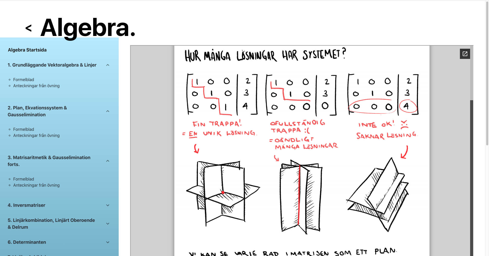
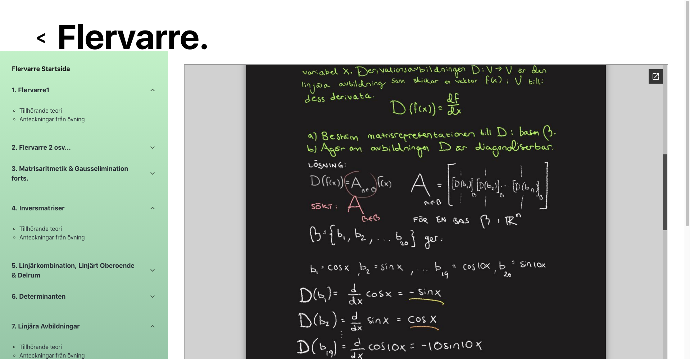

## Mathnotes
A website I built to easily distribute my material to my students, in my work as a math teaching assistant. 

##### Long story short, I thought the page used by the school had too much friction. I mean, for many, these math classes are pretty complicated in their pure form - surely the student's should not have to also work this hard just to reach the material? After using the provided service for half a semester - I built this page instead! :-) Have a look at the page yourself at [kthmatte.web.app](http://kthmatte.web.app/)

#### _The landing page, where you can choose one of the classes I teach: Linear Algebra, Multivariable Calculus or Statistics_

#### _Formula Sheet at the algebra page_

#### _Notes from a Multivariable Calculus class_

## Development
#### The page is built in ReactJS and styled wih Bootstrap and Material UI. The page is hosted through Firebase.